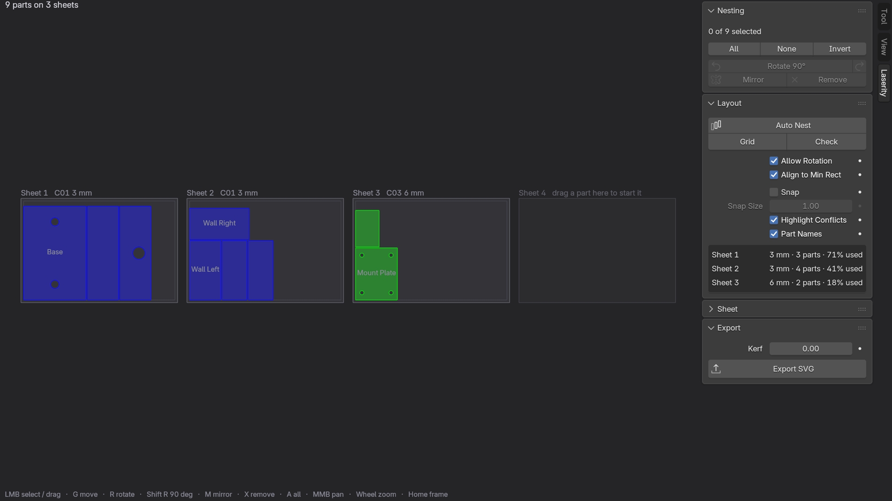
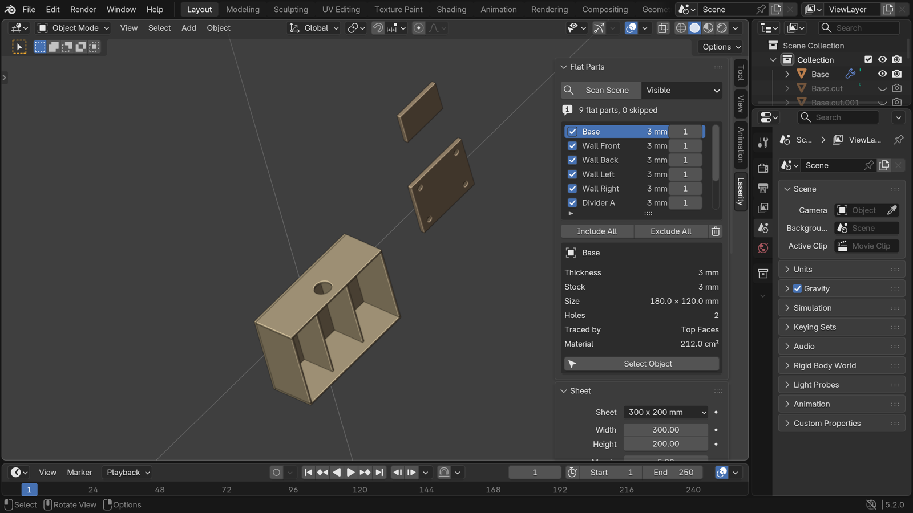
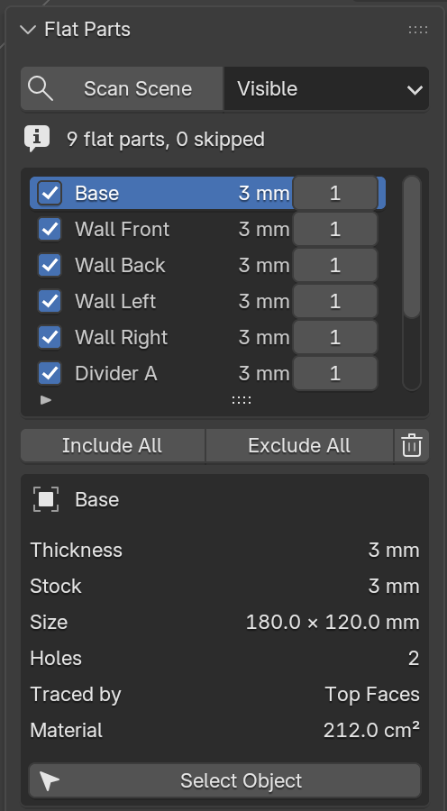

# Laserity for Blender

[](https://github.com/studiomedio/blender-laserity/releases)
[](https://www.blender.org/)
[](https://www.gnu.org/licenses/gpl-3.0)

Find the flat parts in a Blender scene, arrange them on sheets, and export them
as SVG ready for a laser cutter or engraver.



Model your project however you like. Laserity scans the scene for objects that
are actually cuttable from sheet material — plates, ribs, gussets, panels —
measures each one's thickness, flattens it to a 2D outline with its holes, and
packs the results onto sheets. You tune the layout in a dedicated window, then
write one SVG per sheet.

## Requirements

- **Blender 5.1** or newer.

Pure Python — nothing is bundled, nothing is downloaded at install time, and one
universal build covers every platform.

## Installation

### From the Blender Extensions repository

1. In Blender: `Edit > Preferences > Get Extensions`.
2. Search for **Laserity**.
3. Click **Install**.

### From source (development / unreleased changes)

1. Build a ZIP from the `laserity/` directory (or download a release):

   ```bash
   ./build.sh
   ```

   which wraps `blender --command extension build --source-dir laserity
   --output-dir dist`.

2. In Blender: `Edit > Preferences > Get Extensions`.
3. Click the drop-down (top right) → **Install from Disk**.
4. Pick `dist/laserity-<version>.zip`.

## Using it

Everything lives in the 3D viewport sidebar (`N`) under the **Laserity** tab.



1. **Scan Scene.** Every object that qualifies appears in the list with its
   measured thickness. Objects that do not qualify are listed under *Skipped
   Objects* with the reason, so nothing disappears silently.
2. **Choose what to cut.** Untick parts you do not want, and set a quantity for
   parts you need more than one of.
3. **Set the sheet.** Pick a bed or stock size, and set the margin kept clear at
   the edges and the spacing kept between parts.
4. **Arrange.** *Auto Nest* packs everything; *Open Nesting Editor* gives you a
   window to move things by hand.
5. **Export SVG.** One file per sheet, in millimetres.

### What counts as a flat part

A part is a *slab*: geometry whose vertices sit almost entirely on two parallel
planes a short distance apart. That is measured in world space, so an object
tumbled to an arbitrary orientation is measured just the same as an axis-aligned
one, and modifiers are applied first — a plate with boolean holes exports with
its holes.



An object is rejected when it is thicker than *Max Thickness*, when too few of
its vertices lie on the two outer faces (*Slab Strictness*), when it is too
chunky to be sheet material (*Flatness Ratio*), or when it is simply too small.
Each rejection is reported with its reason; the settings live under
*Sheet ▸ Detection*.

Parts whose thicknesses fall within *Group Tolerance* of each other are treated
as the same stock. Stock thicknesses never share a sheet — they are different
pieces of material — so each gets its own run of sheets and its own colour.

<br clear="right">

### Engraving

Two things become engraving rather than cutting:

- **Faces with an engrave material.** Any face whose material name starts with
  `LZ_ENGRAVE` (configurable) is exported as an engraved region.
- **Marked edges.** Freestyle marks by default; UV seams or sharp edges if you
  prefer. Restricted to the part's upper surface unless you say otherwise.

### The nesting editor

*Open Nesting Editor* opens a separate window showing every sheet side by side,
with one spare empty sheet at the end. Drag a part onto the spare to start a new
sheet; empty sheets close themselves up again.

| | |
|---|---|
| `LMB` | Select, or drag to move. `Shift` extends the selection |
| `LMB` drag on empty space | Box select |
| `G` | Move the selection; click to confirm, `Esc` to cancel |
| `R` | Rotate the selection; `Ctrl` snaps to 15° |
| `Shift R` | Rotate 90° |
| `M` | Mirror — for parts that need cutting face down |
| `X` | Remove the selected copies |
| `A` / `Alt A` | Select all / none |
| `MMB` drag, wheel | Pan, zoom |
| `Home` / `F` | Frame everything / the selection |

Parts turn red when they overlap, sit closer than the spacing allows, hang off
the sheet, or share a sheet with a different stock thickness.

### Getting it into LightBurn

LightBurn picks a shape's cut layer by matching its **stroke** colour against
its own palette, so Laserity strokes every path with an exact palette colour and
leaves it unfilled. Each stock thickness gets its own layer, and engraving gets
another — so an import arrives with cutting and engraving already separated, and
you only have to set power and speed.

*Kerf* grows cut paths outwards by half the beam width so parts come out at
their modelled size. Leave it at zero unless you have measured your kerf; it is
usually better handled in LightBurn.

## Development

The geometry work is deliberately kept free of Blender imports so it can be
tested with a plain interpreter:

```
laserity/core/     pure Python — detection, flattening, 2D geometry, nesting, SVG
laserity/props.py  scene properties
laserity/nest.py   glue between the two
laserity/editor.py the nesting editor window
laserity/ui.py     panels
```

```bash
python3 tests/test_core.py                            # 51 geometry tests
blender --background --python tests/test_blender.py   # 29 end-to-end tests
ruff format . && ruff check .                         # 4-space, 100 columns
```

Release and submission steps are in [docs/publishing.md](docs/publishing.md);
the extensions.blender.org listing text lives in
[docs/extension.md](docs/extension.md).

## Licence

GPL-3.0-or-later. See [LICENSE](LICENSE) and [CHANGELOG.md](CHANGELOG.md).
